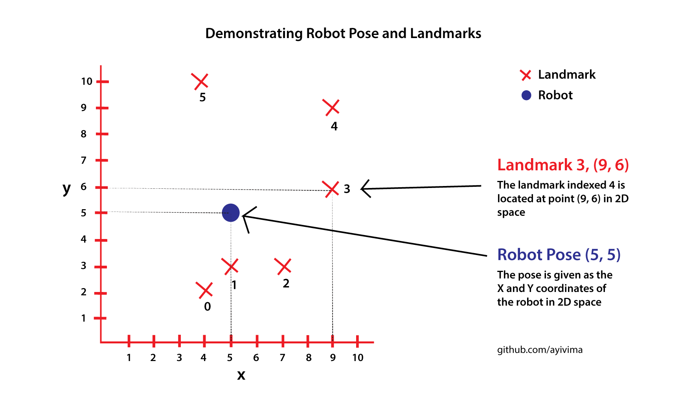
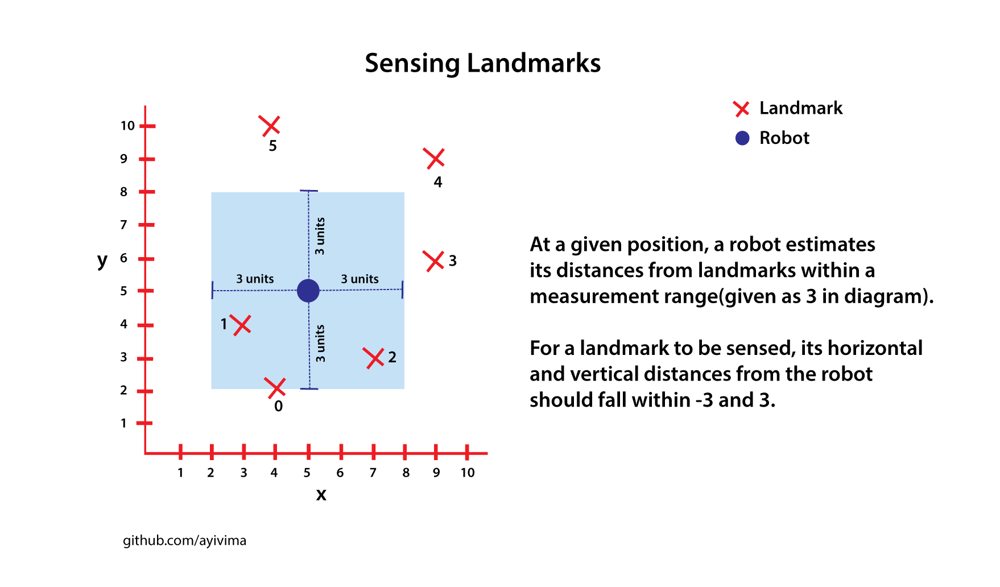
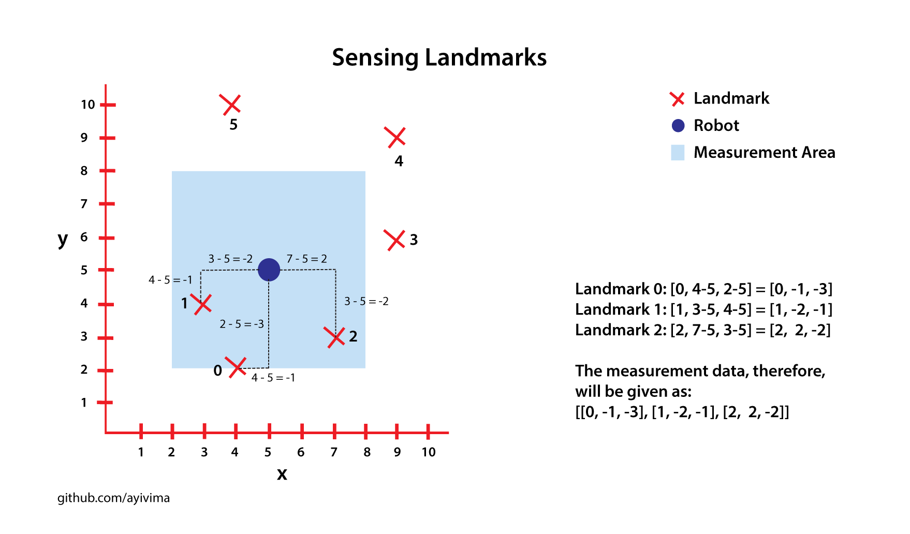
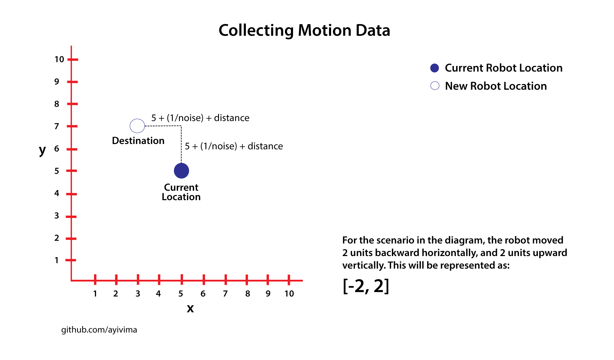
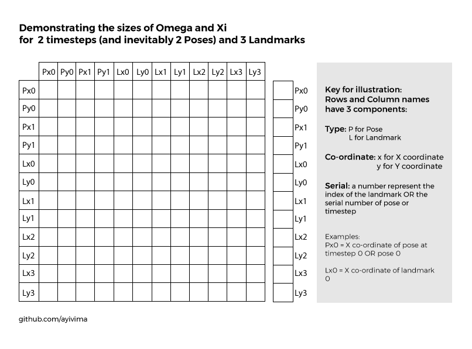
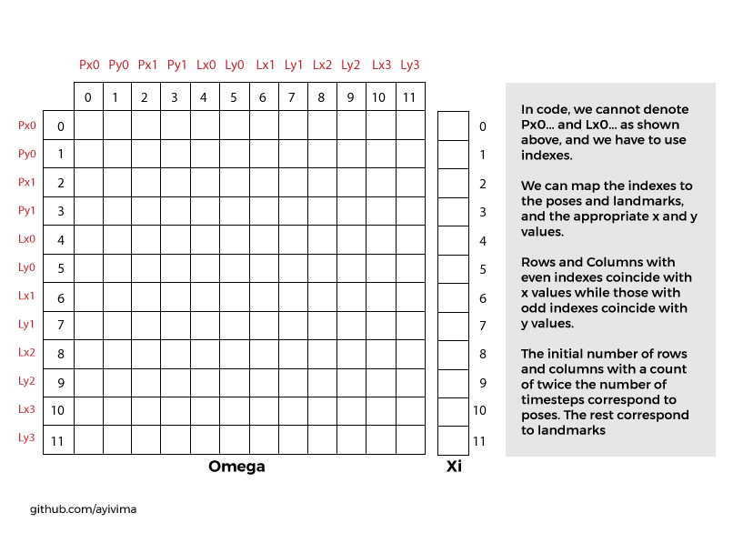
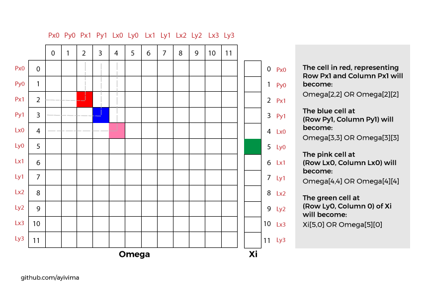
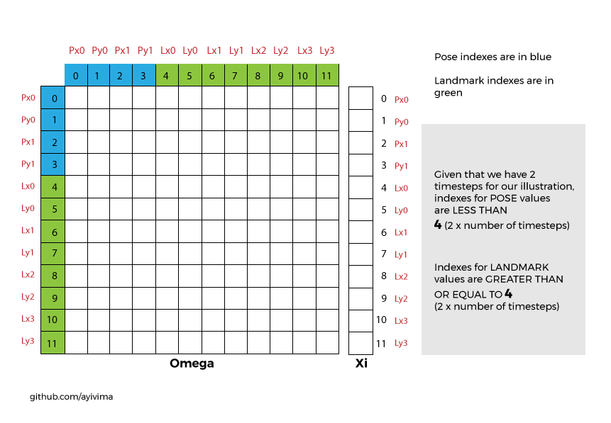

## Poses and Landmark positions

The pose is a point which represents the position or location of the robot at a given time, in 2D space. Likewise, the landmark position marks the location of a landmark in 2D space.



Poses and landmark locations are given as pairs of values, where the first value is the horizontal(x) coordinate, and the second is the vertical(y) coordinate.


## Sensing Landmarks

A importance of the sense function is to allow the robot to measure its distance from landmarks. Among several reasons in the real world, this may help the robot prevent collision.
Thus, for the purpose of the project, when a robot senses, it measures distances of landmarks. The horizontal distance is obtained by subtracting the horizontal coordinate of the robot's current position from the horizontal coordinate of the landmark position. And, the vertical 
distance is obtained by subtracting the vertical coordinate of the robot's current position from the vertical coordinate of the landmark's position.



In the illustration below, a robot senses Landmarks `0`, `1`, `2` which have their absolute horizontal and vertical distances less than or equal to the
specified measurement range of 3. A square measurement area based on the measurement range is highlighted as light blue. Landmarks 3, 4, 5 fall outside the range and, thus, cannot be sensed while the robot is at its current position.



After sensing landmarks, the robot will store this information as a list of lists, with each
sub-list containing the `index of the landmark`, the `Horizontal distance of robot from landmark`, and 
the `Vertical distance of robot from landmark`, as demonstrated below.

```
Landmark 0: [0, 4-5, 2-5] = [0, -1, -3]
Landmark 1: [1, 3-5, 4-5] = [1, -2, -1]
Landmark 2: [2, 7-5, 3-5] = [2,  2, -2]
```

The measurement data, therefore, will be given as:
```
[[0, -1, -3], [1, -2, -1], [2,  2, -2]]
```

#### But there is more to it!

In the illustration above, we are sure of the robot's location. However, this is not the case in the real world. The robot's location can be inaccurate and we have to compensate for it.
We do this by adding an adjustment value, called noise, to the robot's position coordinates.

For example, Landmark 0 has coordinates `4, 2` and the robot is currently at position `5, 5`. Given a measurement noise of 0.3, the measurement for Landmark 0 can be derived as shown below.

```
Measurement Noise = 0.3

Index of Landmark = 0
Adjusted X coordinate of robot position = 5 + 0.3 = 5.3
Adjusted Y coordinate of robot position = 5 + 0.3 = 5.3

Horizontal distance of landmark from robot = 4 - 5.3 = -1.3
Vertical distance of landmark from robot = 2 - 5.3 = -3

Measurement Data = [0, -1.3, -3]
```

## Collecting Motion Data

A robot moves through a certain distance to a new
location at each time step. The new location is a point. 
These new coordinates are obtained by adding the sum 
of a specified distance value and noise, to the coordinates of the old location. As explained
previously, the noise makes up for possible 
inaccuracy in the motion measurements 
made by the robot.



In effect, for each time step, the robot estimates the
horizontal and vertical distances it moves to be at a
new location, with noise factored in.

## Updating Omega and Xi

We will update Omega(the matrix) and Xi(the vector) with landmark measurements and motion data collected as described above. 

#### What will be the sizes of Omega and Xi?

First, remember that Omega is a matrix, with the same number of rows and columns. Additionally, there must be a row for each of these:

+ X co-ordinates of robot poses
+ Y co-ordinates of robot poses
+ X co-ordinates of landmarks
+ Y co-ordinates of landmarks

Consequently, the total number of rows of Omega becomes:
```
Total number of X co-ordinates of robot poses + Total number of Y co-ordinates of robot poses + Total number of X co-ordinates of landmarks + Total number of Y co-ordinates of landmarks
```
This can be further expressed as: 
```
(2 x total number of timesteps) + (2 x total number of landmarks)
```
This is based on the premise that the total number of timesteps must, logically, be the same as the total number of poses. Because, there will only be one pose(position) per timestep. Then, each landmark or pose has 2 values: one for X and another for Y.

Finally, the total number of rows equals the total number of columns.



For Xi, there will be the same number of rows as Omega, but only one column. And, there must be a row for each of X and Y co-ordinates of poses as well as landmarks.

#### Omega and Xi in code 

In code, we will not have the luxury of accessing the rows and columns of Omega using `Px0`, `Lx0`, `Py0`, `Ly0` etc. Instead, we will be using indexes. 





#### How do we access rows and columns representing poses or landmarks in Omega?



Because we know that the number of timesteps equals the number of poses, and each pose or landmark has X and Y values, we can say that indexes that are less than twice the number of timesteps belong to poses. Then, indexes that are greater than or equal to twice the number of timesteps belong to landmarks. 

We also agree that the pose for each timestep corresponds to two rows and two columns. Therefore, we can make these conclusions:

+ If we are given a pose for a given timestep `p`, then `2 * p` becomes the row/column INDEX of the X component of the pose, and `2 * p + 1` for the row/column INDEX of the Y component of the landmark.

+ If we are given a landmark with index `m` and the total number of timesteps is `n`, then `n + (2 * m)` becomes the row/column INDEX for the X component of the landmark, and `n + (2 * m) + 1` for the Y component of the landmark.

+ As illustrated in the diagrams above, the INDEXES of the rows and columns of for X values are even numbers, and those of Y are odd numbers. 

